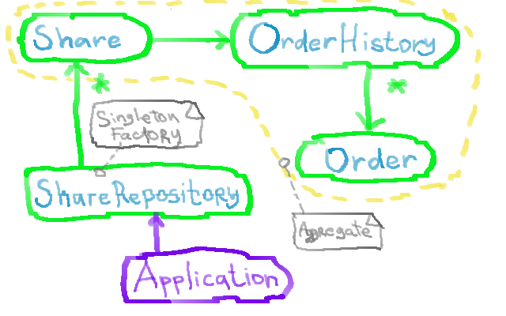

# Simple Stock Market Application

Description
============

Application calculates for a given stock:

1. Dividend yield
2. P/E ratio
3. Records trade with timestamp, quantity of shares, buy & sell indicator and trade price.
4. Volume Weighted Stock Price based on trades in past 15 minutes
5. GBCE of all shares using geometric mean of all prices for all stocks

Domain Design
==============

The sense of the stock domain is share and order, such that we have to depict this
objects in our architecture. **Share** has **Orders** indirectly through OrderHistory.

Class **Share** is a base class. For calculation provided also child class of Share -
**PreferredShare**. Every share class can maintain own specific logic to calculate
ratios.

For an instantiation of **Share** and managing it, we have class **StockRepository**. This 
class creates unique object per every share name.

For calculation of ratios created class **Calculator**. Class **Calculator** provides
static methods for calculation described upper ratios.

